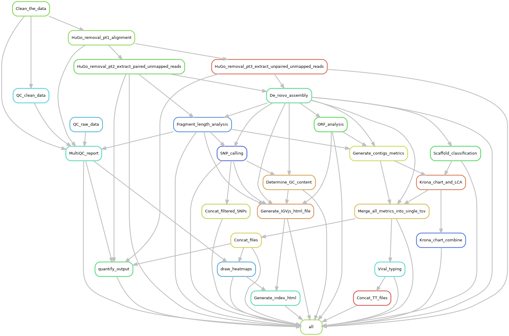

# Jovian, user-friendly metagenomics     

**IMPORTANT: Do not share the code without my express permission as it is unpublished (manuscript in preparation)**  

___


## Table of content  
- [Pipeline description](#pipeline-description)  
  - [Pipeline features](#pipeline-features)  
  - [Pipeline visualizations](#pipeline-visualizations)  
  - [Audit trail](#audit-trail)  
- [Pipeline requirements](#pipeline-requirements)  
  - [Software](#software)  
  - [Databases](#databases)  
- [Configuration](#configuration)  
  - [Installing the pipeline](#installing-the-pipeline)  
  - [Database configuration](#database-configuration)  
  - [Setup Jupyter Notebook user profile](#setup-jupyter-notebook-user-profile)  
  - [Starting the Jupyter Notebook server process](#starting-the-jupyter-notebook-server-process)  
  - [Configuration for remote and grid computers](#configuration-for-remote-and-grid-computers)  
- [How to start a Jovian analysis](#how-to-start-a-jovian-analysis)  
- [Example output](#example-output)  
- [Explanation of output files](#explanation-of-output-files)  
- [FAQ](#faq)  
- [Acknowledgements](#acknowledgements)  

___

## Pipeline description  

The pipeline automatically processes raw Illumina NGS data from human clinical matrices (faeces, serum, etc.) into clinically relevant information such as taxonomic classification, viral typing and minority variant identification (quasispecies).
Wetlab personnel can start, configure and interpret results via interactive Jupyter Notebook websites that are included in the pipeline. This makes doing metagenomics analyses much more accessible and user-friendly since minimal command-line skills are required.  

### Pipeline features    
- Data quality control (QC) and cleaning.  
- Removal of human data (patient privacy).  
- Assembly of short reads into bigger scaffolds (often full viral genomes).  
- Taxonomic annotation:  
  - Classification: Every nucleic acid containing biological entity is determined up to species level.  
  <i>NB. Lowest Common Ancestor (LCA) analysis moves ambigious results up to their last common ancestor.</i>  
  <i>E.g. if a scaffold is found in both bacteria and phages with similar certainty, it is moved to their LCA: the root of all life.</i>  
  - Viral typing: Norovirus, Enterovirus, Hepatitis A and Hepatitis E scaffolds are automatically typing, i.e. sub-species annotation.  
- Viral scaffolds are cross-referenced against the Virus-Host interaction database and NCBI host metadata and reported.  
- Scaffold metrics are generated, e.g. GC content, depth of coverage (DoC), breadth of coverage (BoC), taxonomic E-value, complete taxonomic lineage.  
- Fragment length analysis.  
- Open reading frame (ORF) prediction.  
- Minority variants (quasispecies) identification.  

### Pipeline visualizations  
All data is visualized via interactive Jupyter Notebooks, interactive websites with embedded code that contain the following graphics:  
- Taxonomic results are presented on three levels:  
  - For an entire (multi sample) run, interactive heatmaps are made for non-phage viruses, phages and bacteria. They are stratified to different taxonomic levels.  
  - For a sample level overview, Krona interactive taxonomic piecharts are generated.  
  - For detailed information, interactive tables are generated. Similar to popular spreadsheet applications.  
- Interactive genome browser: Allows in-depth alignment inspection, including predicted ORFs and detected minority variants.  
  
### Audit trail  
An audit trail, used for clinical reproducability and logging, is generated and contains:  
- A unique methodological fingerprint of the code is generated and accessible via GitHub: allowing to exactly reproduce the analysis, even retrospectively by reverting to old versions of the pipeline code.  
- The following information is also logged:  
  - Database timestamps  
  - Pipeline parameters  

___


___

## Pipeline requirements
Jovian has two software dependencies, miniConda and IGVjs, which will be automatically installed by the pipeline on first use. It also depends on several databases that you have to download yourself, as decribed below. And it requires some configuration, also explained below.  

### Software  
|Software name|Installation instructions|Note|  
|:---|:---|:---|  
|```git```|https://git-scm.com/downloads|Is usually already installed on Linux systems.|  
|```curl```|https://curl.haxx.se/|Should already be included in most (all?) Linux distro's.|
|```which```|http://savannah.gnu.org/projects/which|Should already be included in most (all?) Linux distro's.|
|```bzip2```|http://www.bzip.org/|Should already be included in most (all?) Linux distro's.|

### Databases  
|Database name|Link|Installation instructions|
|:---|:---|:---|
|```NCBI NT & NR```|ftp://ftp.ncbi.nlm.nih.gov/blast/db/|[link](#blast-nt-nr-and-taxdb-databases)|
|```NCBI Taxdump```|ftp://ftp.ncbi.nlm.nih.gov/pub/taxonomy/|[link](#blast-nt-nr-and-taxdb-databases)|
|```NCBI New_taxdump```|ftp://ftp.ncbi.nlm.nih.gov/pub/taxonomy/new_taxdump/|[link](#ncbi-new_taxdump-database)|
|```Latest Human Genome```|https://support.illumina.com/sequencing/sequencing_software/igenome.html|[link](#human-genome)|
|```Virus-Host interaction database```|http://www.genome.jp/virushostdb/note.html|[link](#virus-host-interaction-database)|

___

## Configuration  
Pipeline software, databases and Jupyter Notebook need to be downloaded, installed and configured as described below.  

### Installing the pipeline  
- Installing the Jovian pipeline requires a specific file (.ncbirc) in your home directory, you can create this file with the command `touch ~/.ncbirc`
    - This file (.ncbirc) **needs** to be updated later on with information regarding your local setup in order to make the pipeline actually work.
- Navigate to a directory where you want to analyse your datasets and download the pipeline via `git clone https://github.com/DennisSchmitz/Jovian.git`  
- Navigate to the newly created `Jovian` folder.
- Depending on your local setup, you need to modify the config files in order to make the pipeline work as intended.
    - **[For grid-computing setups]** Open the file `profile/config.yaml` with your text-editor of choice and modify the amount of cores to match your setup. It is also important to update the DRMAA queue information to match your setup. If this is unknown, contact your local system administrator(s) for more information.
    - **[For standalone-computing setups]** Open the file `profile/config.yaml` with your text-editor of choice and modify the amount of cores to something acceptable for your setup. (depending on your dataset and server, 8 to 12 cores should be fine). Then comment out the lines starting with "drmaa", this can be done by placing a "#" in front of the line as in the example below: 
    ```
    #drmaa: " -q bio -n {threads} -R \"span[hosts=1]\""
    #drmaa-log-dir: logs/drmaa
    ```
- Now run `bash jovian -ic` to begin the interactive installer for jovian (make sure you run this command while in the `Jovian` folder)
    - This command will install all files, folders and programs necessary for Jovian, it will however only do so if you give consent to do so. Once done with the installation it will go on with building different "environments" which are necessary for analysing the data.
- Follow the instructions on screen and answer the questions given in order to completely install Jovian. Installation can take roughly up to an hour or two (depending on your system). It is only necessary to stay with your computer during the interactive installer which won't take longer than 30 minutes.
    - If you're inexperienced with the commandline, it is best to simply answer all questions in the interactive installer with "yes"  or "y". 

#### Installing IGVjs
The installation of IGVjs is usually handled by the interactive Jovian installer (described above).  
In case the installation of IGVjs is declined during installation and you wish to install/use IGVjs at a moment of your convenience, run the following command:  
`bash jovian -ii`  
The installation of IGVjs will now start, this can take up to 30 minutes.

### Database configuration  
**N.B. These databases should be updated simulatenously, otherwise the taxonomy IDs might not be valid.**  

#### BLAST NT, NR and taxdb databases  
- Use the `Jovian_helper` environment, i.e. `conda activate Jovian_helper`.  
- Use the script to download...  
  - NT: `cd [desired_database_location]; bash ${CONDA_PREFIX}/bin/update_blastdb.pl --decompress nt`  
  - NR: `cd [desired_database_location]; bash ${CONDA_PREFIX}/bin/update_blastdb.pl --decompress nr`  
  - Taxdb: `cd [desired_database_location]; bash ${CONDA_PREFIX}/bin/update_blastdb.pl --decompress taxdb`  
- Put a file named [.ncbirc](files/.ncbirc) in your home (`cd ~`) directory. See this example [.ncbirc](files/.ncbirc), remember to update it for your local setup!   
  - We advise you to setup automatic `crontab` scripts to update these databases every week, please contact your own IT support for help with this.  

#### NCBI new_taxdump database  
This section is work in progress, will be automated in the bash wrapper, see issue #7.  
- Download `new_taxdump` from https://ftp.ncbi.nlm.nih.gov/pub/taxonomy/new_taxdump/   
- Extract it, it should contain the `rankedlineage` and `host` files.
- Then change the delimiters via this one liner:
 **N.B. execute this command from the directory where these `*.dmp` files are located**  
 `for file in *.dmp; do awk '{gsub("\t",""); if(substr($0,length($0),length($0))=="|") print substr($0,0,length($0)-1); else print $0}' < ${file} > ${file}.delim; done`  
- When you run a Jovian analysis, update the pathing information in [profile/pipeline_parameters.yaml](profile/pipeline_parameters.yaml) to your local pathing.  

#### Krona resources  
- Use the `Jovian_helper` environment, i.e. `conda activate Jovian_helper`.  
- Use the code below to generate the Krona taxonomy files:  
  ```cd [desired_database_location]; bash ${CONDA_PREFIX}/opt/krona/updateTaxonomy.sh ./ ; bash ${CONDA_PREFIX}/opt/krona/updateAccessions.sh ./```  
- When you run a Jovian analysis, update the pathing information to the Krona resources in [profile/pipeline_parameters.yaml](profile/pipeline_parameters.yaml) to your local pathing.  

#### Human Genome  
- Download the latest Human Genome version from https://support.illumina.com/sequencing/sequencing_software/igenome.html  
  - Select the NCBI version of `GRCh38`. NB do NOT download the `GRCh38Decoy` version! This version will filter out certain human viruses.  
- The `GRCh38` version of the human genome still contains an Epstein Barr virus (EBV) contig, this needs to be removed as shown below:  
  - Navigate to `NCBI/GRCh38/Sequence/Bowtie2Index/` in the newly downloaded Human Genome.  
  - Remove the EBV contig via `awk '{print >out}; />chrEBV/{out="EBV.fa"}' out=nonEBV.fa genome.fa` ([source](https://unix.stackexchange.com/questions/202514/split-file-into-two-parts-at-a-pattern)).  
  - Remove `EBV.fa` and replace `genome.fa` with `nonEBV.fa` via `rm EBV.fa; mv nonEBV.fa genome.fa`  
  - Activate the `Jovian_helper` environment via `source activate Jovian_helper` and index the updated `genome.fa` file via `bowtie2-build --threads 10 genome.fa genome.fa`.  
- When you run a Jovian analysis, update the pathing information to your cleaned and bowtie2 indexed `genome.fa` file in [profile/pipeline_parameters.yaml](profile/pipeline_parameters.yaml).  

#### Virus-Host interaction database  
- Download the Virus-Host database (Mihara et al. 2016) via...  
  - ```cd [desired_database_location]; wget ftp://ftp.genome.jp/pub/db/virushostdb/virushostdb.tsv```  
- When you run a Jovian analysis, update the pathing information to the Virus-Host interaction table in [profile/pipeline_parameters.yaml](profile/pipeline_parameters.yaml) to your local pathing.  

### Setup Jupyter Notebook user profile  
- Ensure that the `Jovian_master` environment is active, otherwise, activate it via `source activate Jovian_master`
- We need to update the Jupyter theme (jt) to properly visualize IGVjs via `jt -t grade3 -fs 95 -altp -tfs 11 -nfs 115 -cellw 88% -T` [source here](https://github.com/dunovank/jupyter-themes)  
- Above changes trigger a known bug for some fonts, fix this by adding `padding: 13px;` to the field `div.output_area` in `~/.jupyter/custom/custom.css`. As shown below:  
  ```div.output_area {  
  display: -webkit-box;  
  padding: 13px;    
  }```  
- Generate a jupyter notebook config file via `jupyter notebook --generate-config`, and then update the newly generated file (`~/.jupyter/jupyter_notebook_config.py`) with the text below.  
  ```c.NotebookApp.iopub_data_rate_limit = 100000000 # NB, uncomment this line!  
  c.NotebookApp.ip = 'your_server_ip_adress_here' # NB, uncomment this line!```

### Starting the Jupyter Notebook server process  
- Open a Linux terminal and navigate to the root via `cd /`  
- Start the Jupyter Notebook server via `jupyter notebook`. NB Keep this proces runnning for as long as you want to access these Jupyter Notebooks Reports.  
- The above command should give your a link that you can access via your browser, please open this link from your work station. If you cannot find this link, you can run `jupyter notebook list` from a seperate terminal to generate it.  
- Now activate the addons listed below. You can access this by replacing everything after the last `/` by `nbextenstions/`.  
  ```Code Font Size  
  Codefolding  
  Codefolding in Editor  
  Collapsible Heading  
  ExecuteTime # Check box "When cells' outputs are cleared, also clear their timing data, e.g. when using the "Kernel > Restart & Clear Output" menu item"  
  Freeze  
  Hide input all  
  Highlight selected word  
  spellchecker  
  Table of Contents (2) # Uncheck box "Automatically number notebook's sections"  
  Toggle all line numbers  
  Tree Filter  
  Variable Inspector```

### Configuration for remote and grid computers
- If you run the pipeline on a remote computer (e.g. server/HPC or grid) you need the system admins of those systems to make Jupyter Notebook accessible to your local computer. 
  
___
 
## How to start a Jovian analysis  
Currently, the method to launch analyses via the Jupyter Notebook requires some minor tweaks. So I cannot share it yet, we recommend you to use the command-line method below.  

<b>Jupyter Notebook method:</b>  
- Via your Jupyter Notebook browser connection, go to the `Jovian` folder [created above](#installing-the-pipeline). Then, open `Notebook_portal.ipynb`.  
- Follow the instructions in this notebook to start an analysis.  

<b>Command-line interface method:</b>  
- Make sure the installation of Jovian is completed, see: [installing the pipeline](#installing-the-pipeline)
- Go to the `Jovian` folder [created above](#installing-the-pipeline)
- Configure pipeline parameters by changing the [profile/pipeline_parameters.yaml](profile/pipeline_parameters.yaml) file. Either via Jupyter Notebook or with a commandline text-editor of choice.  
- We recommended you do a `dry-run` before each analysis to check if there are any typo's, missing files or other errors. This can be done via `bash jovian -i <input_directory> -n`
- If the dry-run has completed without errors, you are ready to start a real analysis with the following command:  
`bash jovian -i <input_directory>` 
- After the pipeline has finished, open `Notebook_report.ipynb` via your browser. Click on `Cell` in the toolbar, then press `Run all` and wait for data to be imported.  
  - N.B. You need to have a Jupyter notebook process running in the background, as described [here](#starting-the-jupyter-notebook-server-process); i.e. `jupyter notebook`.  
    
___

## Example output  

Will be added at a later date.  

_____

## Explanation of output files  
|Folder|Contents|
|:---|:---|
|bin/ |Contains the scripts required for Jovian to work |
|data/ | Contains intermediate and detailed data |
|envs/ | Contains all conda environments for the pipeline |
|files/ | Contains ancillary files for the pipeline |
|logs/ | Contains all Jovian log files, use these files to troubleshoot errors |
|profile/ | Contains the files with Snakemake and pipeline parameters |
|results/ | This contains all files that are important for end-users and are imported by the Jupyter Report |

___

## FAQ
- Why are there multiple lines per taxid in the host table?  
  - In the Virus-Host interaction database there are sometimes multiple entries for a single taxid, meaning, there are multiple known hosts. Therefore, we follow this formatting and print the different hosts on multiple lines.  

___

## Acknowledgements

|Name |Publication|Website|
|:---|:---|:---|
|BBtools|NA|https://jgi.doe.gov/data-and-tools/bbtools/|
|BEDtools|Quinlan, A.R. and I.M.J.B. Hall, BEDTools: a flexible suite of utilities for comparing genomic features. 2010. 26(6): p. 841-842.|https://bedtools.readthedocs.io/en/latest/|
|BLAST|Altschul, S.F., et al., Gapped BLAST and PSI-BLAST: a new generation of protein database search programs. 1997. 25(17): p. 3389-3402.|https://www.ncbi.nlm.nih.gov/books/NBK279690/|
|BWA|Li, H. (2013). Aligning sequence reads, clone sequences and assembly contigs with BWA-MEM. arXiv preprint arXiv:1303.3997.|https://github.com/lh3/bwa|
|BioConda|Grüning, B., et al., Bioconda: sustainable and comprehensive software distribution for the life sciences. 2018. 15(7): p. 475.|https://bioconda.github.io/|
|Biopython|Cock, P. J., Antao, T., Chang, J. T., Chapman, B. A., Cox, C. J., Dalke, A., ... & De Hoon, M. J. (2009). Biopython: freely available Python tools for computational molecular biology and bioinformatics. Bioinformatics, 25(11), 1422-1423.|https://biopython.org/|
|Bokeh|Bokeh Development Team (2018). Bokeh: Python library for interactive visualization.|https://bokeh.pydata.org/en/latest/|
|Bowtie2|Langmead, B. and S.L.J.N.m. Salzberg, Fast gapped-read alignment with Bowtie 2. 2012. 9(4): p. 357.|http://bowtie-bio.sourceforge.net/bowtie2/index.shtml|
|Conda|NA|https://conda.io/|
|DRMAA|NA|http://drmaa-python.github.io/|
|FastQC|Andrews, S., FastQC: a quality control tool for high throughput sequence data. 2010.|https://www.bioinformatics.babraham.ac.uk/projects/fastqc/|
|gawk|NA|https://www.gnu.org/software/gawk/|
|GNU Parallel|O. Tange (2018): GNU Parallel 2018, March 2018, https://doi.org/10.5281/zenodo.1146014.|https://www.gnu.org/software/parallel/|
|Git|NA|https://git-scm.com/|
|igvtools|NA|https://software.broadinstitute.org/software/igv/igvtools|
|Jupyter Notebook|Kluyver, Thomas, et al. "Jupyter Notebooks-a publishing format for reproducible computational workflows." ELPUB. 2016.|https://jupyter.org/|
|Jupyter_contrib_nbextension|NA|https://github.com/ipython-contrib/jupyter_contrib_nbextensions|
|Jupyterthemes|NA|https://github.com/dunovank/jupyter-themes|
|Krona|Ondov, B.D., N.H. Bergman, and A.M. Phillippy, Interactive metagenomic visualization in a Web browser. BMC Bioinformatics, 2011. 12: p. 385.|https://github.com/marbl/Krona/wiki|
|Lofreq|Wilm, A., et al., LoFreq: a sequence-quality aware, ultra-sensitive variant caller for uncovering cell-population heterogeneity from high-throughput sequencing datasets. 2012. 40(22): p. 11189-11201.|http://csb5.github.io/lofreq/|
|Minimap2|Li, H., Minimap2: pairwise alignment for nucleotide sequences. Bioinformatics, 2018.|https://github.com/lh3/minimap2|
|MultiQC|Ewels, P., et al., MultiQC: summarize analysis results for multiple tools and samples in a single report. 2016. 32(19): p. 3047-3048.|https://multiqc.info/|
|Nb_conda|NA|https://github.com/Anaconda-Platform/nb_conda|
|Nb_conda_kernels|NA|https://github.com/Anaconda-Platform/nb_conda_kernels|
|Nginx|NA|https://www.nginx.com/|
|Numpy|Walt, S. V. D., Colbert, S. C., & Varoquaux, G. (2011). The NumPy array: a structure for efficient numerical computation. Computing in Science & Engineering, 13(2), 22-30.|http://www.numpy.org/|
|Pandas|McKinney, W. Data structures for statistical computing in python. in Proceedings of the 9th Python in Science Conference. 2010. Austin, TX.|https://pandas.pydata.org/|
|Picard|NA|https://broadinstitute.github.io/picard/|
|Prodigal|Hyatt, D., et al., Prodigal: prokaryotic gene recognition and translation initiation site identification. 2010. 11(1): p. 119.|https://github.com/hyattpd/Prodigal/wiki/Introduction|
|Python|G. van Rossum, Python tutorial, Technical Report CS-R9526, Centrum voor Wiskunde en Informatica (CWI), Amsterdam, May 1995.|https://www.python.org/|
|Qgrid|NA|https://github.com/quantopian/qgrid|
|SAMtools|Li, H., et al., The sequence alignment/map format and SAMtools. 2009. 25(16): p. 2078-2079.|http://www.htslib.org/|
|SPAdes|Nurk, S., et al., metaSPAdes: a new versatile metagenomic assembler. Genome Res, 2017. 27(5): p. 824-834.|http://cab.spbu.ru/software/spades/|
|Seqtk|NA|https://github.com/lh3/seqtk|
|Snakemake|Köster, J. and S.J.B. Rahmann, Snakemake—a scalable bioinformatics workflow engine. 2012. 28(19): p. 2520-2522.|https://snakemake.readthedocs.io/en/stable/|
|Tabix|NA|www.htslib.org/doc/tabix.html|
|tree|NA|http://mama.indstate.edu/users/ice/tree/|
|Trimmomatic|Bolger, A.M., M. Lohse, and B. Usadel, Trimmomatic: a flexible trimmer for Illumina sequence data. Bioinformatics, 2014. 30(15): p. 2114-20.|www.usadellab.org/cms/?page=trimmomatic|
|Virus-Host Database|Mihara, T., Nishimura, Y., Shimizu, Y., Nishiyama, H., Yoshikawa, G., Uehara, H., ... & Ogata, H. (2016). Linking virus genomes with host taxonomy. Viruses, 8(3), 66.|http://www.genome.jp/virushostdb/note.html|
|Virus typing tools|Kroneman, A., Vennema, H., Deforche, K., Avoort, H. V. D., Penaranda, S., Oberste, M. S., ... & Koopmans, M. (2011). An automated genotyping tool for enteroviruses and noroviruses. Journal of Clinical Virology, 51(2), 121-125.|https://www.ncbi.nlm.nih.gov/pubmed/21514213|

#### Authors:
- Dennis Schmitz ([RIVM](https://www.rivm.nl/en) and [EMC](https://www6.erasmusmc.nl/viroscience/))  
- Sam Nooij ([RIVM](https://www.rivm.nl/en) and [EMC](https://www6.erasmusmc.nl/viroscience/))  
- Robert Verhagen ([RIVM](https://www.rivm.nl/en))  
- Thierry Janssens ([RIVM](https://www.rivm.nl/en))  
- Jeroen Cremer ([RIVM](https://www.rivm.nl/en))  
- Florian Zwagemaker ([RIVM](https://www.rivm.nl/en))  
- Mark Kroon ([RIVM](https://www.rivm.nl/en))  
- Erwin van Wieringen ([RIVM](https://www.rivm.nl/en))  
- Harry Vennema ([RIVM](https://www.rivm.nl/en))  
- Annelies Kroneman ([RIVM](https://www.rivm.nl/en))  
- Marion Koopmans ([EMC](https://www6.erasmusmc.nl/viroscience/))  

____
_This project/research has received funding from the European Union’s Horizon 2020 research and innovation programme under grant agreement No. 643476._
____
